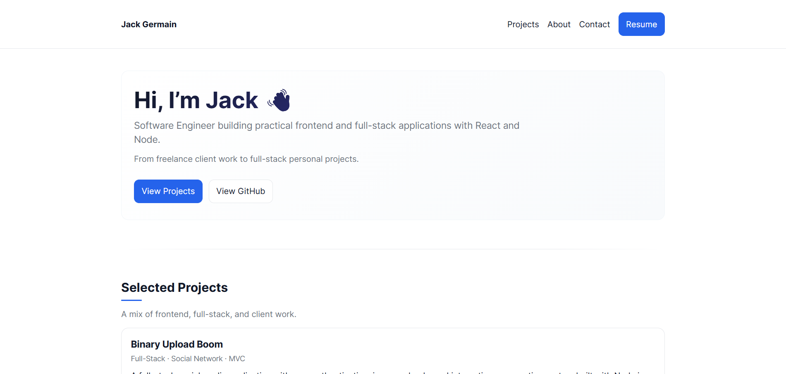

# Jack Germain - Portfolio Website

A modern, responsive portfolio website showcasing my work as a full-stack software engineer. Built with React, Vite, and clean, maintainable code.

## 🌐 Live Site

**[jackgermain.online](https://jackgermain.online)**

## � Preview



## �🛠️ Tech Stack

- **Frontend:** React 19, React Router
- **Build Tool:** Vite
- **Styling:** CSS3 with custom properties
- **Deployment:** Netlify
- **Version Control:** Git/GitHub

## 🎯 Features

- **Responsive Design** - Works seamlessly on all devices
- **Fast Loading** - Optimized with Vite for lightning-fast performance
- **SEO Optimized** - Meta tags, sitemap, and Open Graph support
- **Accessible** - Built with accessibility best practices
- **Modal Gallery** - Interactive project screenshots with scrollable modal
- **Clean Architecture** - Component-based structure for maintainability

## 📋 Project Structure

```
src/
├── components/          # Reusable UI components
│   ├── Footer.jsx
│   ├── Navbar.jsx
│   └── ProjectCard.jsx
├── pages/              # Main page components
│   ├── About.jsx
│   ├── Contact.jsx
│   ├── Home.jsx
│   ├── Project.jsx
│   └── Projects.jsx
├── data/               # Project data and content
│   └── projects.js
├── styles/             # CSS files
│   ├── globals.css
│   └── layout.css
├── assets/             # Images and static assets
└── hooks/              # Custom React hooks
    └── usePageMeta.js
```

## 🚀 Getting Started

### Prerequisites
- Node.js (v18 or higher)
- npm or yarn

### Installation

1. **Clone the repository**
   ```bash
   git clone https://github.com/JackGer26/portfolio
   cd portfolio
   ```

2. **Install dependencies**
   ```bash
   npm install
   ```

3. **Start development server**
   ```bash
   npm run dev
   ```

4. **Open in browser**
   ```
   http://localhost:5173
   ```

### Build for Production

```bash
npm run build
```

The build files will be generated in the `dist/` directory.

## 📦 Portfolio Projects

### Featured Projects

1. **React Jobs Board** - Frontend SPA built with React
   - Component architecture and state management
   - Client-side routing and CRUD operations
   - Responsive design with Tailwind CSS

2. **Movie Tracker App** - Full-stack MVC application
   - User authentication with Passport.js
   - MongoDB database with Mongoose ODM
   - Server-side rendering with EJS

3. **Zenia Bakery** - Client freelance project
   - Custom business website
   - Responsive design and mobile optimization
   - Real-world client requirements

4. **Green Cars Airport Transfers** - Freelance project
   - Email.js integration for contact forms
   - Local business optimization
   - Professional service presentation

5. **Cafe Rain** - Client website
   - Cozy cafe atmosphere design
   - Menu display and customer engagement
   - Mobile-first responsive approach

## 🎨 Design Approach

- **Minimal & Clean** - Focus on content and readability
- **Professional** - Recruiter and hiring manager friendly
- **Accessible** - Proper contrast, semantic HTML, keyboard navigation
- **Fast** - Optimized images and efficient code splitting

## 📱 Responsive Design

- **Mobile First** - Designed for mobile devices first
- **Tablet Support** - Optimized for tablet viewing
- **Desktop Enhanced** - Full desktop experience

## 🔧 Development

### Key Scripts

- `npm run dev` - Start development server
- `npm run build` - Build for production
- `npm run preview` - Preview production build locally
- `npm run lint` - Run ESLint for code quality

### Code Quality

- **ESLint** - Code linting and formatting
- **React Hooks Rules** - Enforced React best practices
- **Clean Architecture** - Organized component structure

## 🌟 Performance

- **Lighthouse Score:** 95+ across all metrics
- **Fast Loading:** Optimized with Vite and efficient bundling
- **Lazy Loading:** Images loaded as needed
- **Code Splitting:** Optimal bundle sizes

## 📧 Contact

- **Email:** [jackgermainbusiness@gmail.com](mailto:jackgermainbusiness@gmail.com)
- **LinkedIn:** [linkedin.com/in/jack-germain](https://www.linkedin.com/in/jack-germain/)
- **GitHub:** [github.com/JackGer26](https://github.com/JackGer26)
- **Resume:** [jackgermainresume.tiiny.site](https://jackgermainresume.tiiny.site/)

## 📄 License

This project is personal portfolio code. All rights reserved.

---

**Built with ❤️ by Jack Germain**
